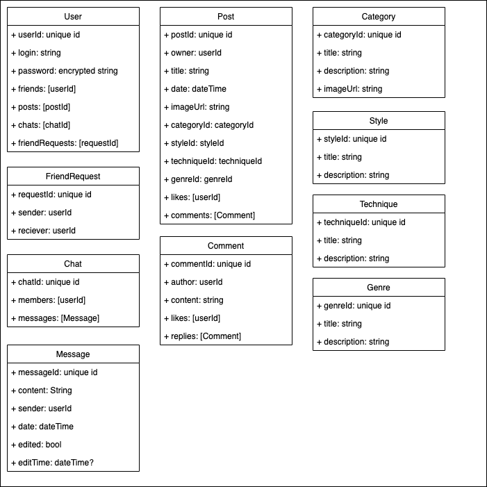

# ITandDDP

## Art Portal social network
* Social network for artists and designers

## Stack
* html, css, js Frontend
* express js Backend
* mongoDB database
* figma for mockups

## Features
* Login/Password registration and authorization
* Artworks wall for each profile
* CRUD for artworks posts (for it's owners)
* Top rated post system (Top 100)
* Friends system
* Chats
* Archive system for favorite posts
* Statistics page
* Search feature

## Feature detais
* JWT Authorization
* Cookies usage
* HTTP RESTful API

## Additional
* [Figma mockup](https://www.figma.com/file/dkVyDuuJfs4rYi6yMATlNM/Art-Portal?t=QxPJZ3eBRM0dKUfH-1)
* 